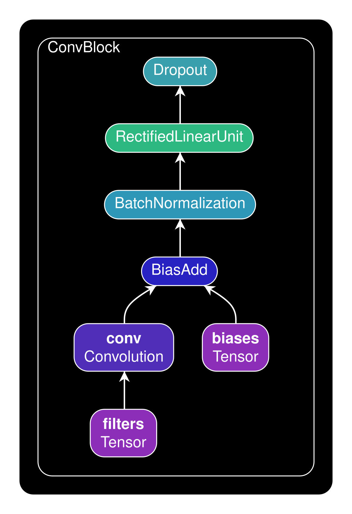

<h1 class="code-line" data-line-start=0 data-line-end=1 >Siemens Healthineers -  ECG Based Classification</h1>
<h3 class="code-line" data-line-start=2 data-line-end=3 >Challenge ⛓</h3>

To propose and implement an intelligent real time heartbeat classification algorithm and supplement results with Explainable AI

<h3 class="code-line" data-line-start=6 data-line-end=7 >Description 🤖</h3>

Cardio Vascular Diseases happens to be the major contributor of death rate. Heartbeat is a basic physiological function of the human body and it indicates and helps a lot in investigation of heart function. One non-invasive method of assessing heart function is using an ECG. The dataset provided for this challenge has 17 classes of ECGs. There are attempts made classifying this data using different approaches, please refer online for sources. There is one article which is provided in the references section for you to understand the problem better

<h3 class="code-line" data-line-start=9 data-line-end=10 >What it does? 🪄</h3>

I devised an innovative algorithm, for the classification of ECG into 17 classes.

<ul>
<li class="has-line-data" data-line-start="12" data-line-end="13">Firstly, the algorithm enhances the provided dataset, by using a roll-over technique, such that each class is populated with new cases and a balanced dataset is formed.</li>
<li class="has-line-data" data-line-start="13" data-line-end="15">Secondly, a dual path Deep Architecture is devised, with analysing various provided parameters.</li>
</ul>
<h3 class="code-line" data-line-start=15 data-line-end=16 >Devised Algorithms 🔭</h3>
<ul>
<li class="has-line-data" data-line-start="17" data-line-end="22">
<h4 class="code-line" data-line-start=17 data-line-end=18 >Roll-Over Technique 🔬</h4>
<ul>
<li class="has-line-data" data-line-start="18" data-line-end="19">For the cases which have lestt cases in the provided dataset, the dataset for that class is equally rolled into multiple samples alternatively, using <code>numpy.roll()</code>.</li>
<li class="has-line-data" data-line-start="19" data-line-end="20">Here I used this rollover in clockwise and anticlockwise fashion on alternate samples from the dataset, to make the provided dataset rich.</li>
<li class="has-line-data" data-line-start="20" data-line-end="21">To balance the roll for each set, i rolled the dataset to a multiple of two, into clockwise and anticlockwise direction alternatively.</li>
<li class="has-line-data" data-line-start="21" data-line-end="22"><strong>Hence the transformed dataset is balanced, without losing its significance.</strong></li>
</ul>
</li>
</ul>

<h4 class="code-line" data-line-start=23 data-line-end=24 >Dataset is transformed to following :</h4>
<table class="table table-striped table-bordered">
<thead>
<tr>
<th>ClassNum</th>
<th>ClassName</th>
<th>SetCount</th>
</tr>
</thead>
<tbody>
<tr>
<td>0</td>
<td>6 WPW</td>
<td>273</td>
</tr>
<tr>
<td>1</td>
<td>5 SVTA</td>
<td>273</td>
</tr>
<tr>
<td>2</td>
<td>2 APB</td>
<td>264</td>
</tr>
<tr>
<td>3</td>
<td>15 RBBBB</td>
<td>248</td>
</tr>
<tr>
<td>4</td>
<td>11 IVR</td>
<td>280</td>
</tr>
<tr>
<td>5</td>
<td>4 AFIB</td>
<td>270</td>
</tr>
<tr>
<td>6</td>
<td>7 PVC</td>
<td>270</td>
</tr>
<tr>
<td>7</td>
<td>1 NSR</td>
<td>283</td>
</tr>
<tr>
<td>8</td>
<td>13 Fusion</td>
<td>275</td>
</tr>
<tr>
<td>9</td>
<td>9 Trigemy</td>
<td>273</td>
</tr>
<tr>
<td>10</td>
<td>3 AFL</td>
<td>280</td>
</tr>
<tr>
<td>11</td>
<td>12 VFL</td>
<td>280</td>
</tr>
<tr>
<td>12</td>
<td>14 LBBBB</td>
<td>206</td>
</tr>
<tr>
<td>13</td>
<td>16 SDHB</td>
<td>280</td>
</tr>
<tr>
<td>14</td>
<td>8 Bigeminy</td>
<td>275</td>
</tr>
<tr>
<td>15</td>
<td>17 PR</td>
<td>270</td>
</tr>
<tr>
<td>16</td>
<td>10 VT</td>
<td>280</td>
</tr>
</tbody>
</table>

<ul>
<li class="has-line-data" data-line-start="45" data-line-end="59">
<h4 class="code-line" data-line-start=45 data-line-end=46 >Deep Neural Network Architecture 🔬</h4>
<ul>
<li class="has-line-data" data-line-start="46" data-line-end="47">As I mentioned, the data has been transformed by using roll-over technique, so to counter it model has been made specifically such that, for one path it takes the given data, and for the other it takes the reverse of the same data. So it counters, the clockwise and anti-clockwise roll-over applied and gives accurate predictions.</li>
<li class="has-line-data" data-line-start="47" data-line-end="59"><strong>Model contains the following sub-models:</strong>
<ul>
<li class="has-line-data" data-line-start="48" data-line-end="50"><strong>Conv Block</strong>
<table class="table table-striped table-bordered">
<thead>
<tr>
<th style="text-align:left; ">Architecture</th>
<th style="text-align:center">Architecture Details</th>
</tr>
</thead>
<tbody>
<tr>
<td style="text-align:left; width: max-content"></td>
<td style="text-align:left"><pre><code>ConvBlock (x3)
    (
    (conv1d_1): Conv1d(1, 4, kernel_size=(5,), stride=(2,))
    (batch_norm_1d_1): BatchNorm1d(4, eps=1e-05, momentum=0.1, affine=True, track_running_stats=True)
    (relu): ReLU()
    (dropout_): Dropout(p=0.005, inplace=False)
    (conv1d_2): Conv1d(4, 16, kernel_size=(4,), stride=(2,))
    (batch_norm_1d_2): BatchNorm1d(16, eps=1e-05, momentum=0.1, affine=True, track_running_stats=True)
    (relu): ReLU()
    (dropout_): Dropout(p=0.005, inplace=False)
    (conv1d_3): Conv1d(16, 32, kernel_size=(4,), stride=(2,))
    (batch_norm_1d_3): BatchNorm1d(32, eps=1e-05, momentum=0.1, affine=True, track_running_stats=True)
    (relu): ReLU()
    (dropout_): Dropout(p=0.005, inplace=False)
    (conv1d_4): Conv1d(32, 32, kernel_size=(4,), stride=(2,))
    (batch_norm_1d_4): BatchNorm1d(32, eps=1e-05, momentum=0.1, affine=True, track_running_stats=True)
    (relu): ReLU()
    (dropout_): Dropout(p=0.005, inplace=False)
    )
</code></pre></td>
</tr>
</tbody>
</table>

</li>
<li class="has-line-data" data-line-start="50" data-line-end="51">Linear Block</li>
<li class="has-line-data" data-line-start="51" data-line-end="52">Attention Model</li>
<li class="has-line-data" data-line-start="52" data-line-end="53">InitConv Block</li>
<li class="has-line-data" data-line-start="53" data-line-end="54">Long-Short Term Memory Block</li>
<li class="has-line-data" data-line-start="54" data-line-end="59"></li>
</ul>
</li>
</ul>
</li>
</ul>
<h2 class="code-line" data-line-start=59 data-line-end=60 >Model Summary</h2>
<pre><code>CnnBiLSTM1D
    (
    (tanh): Tanh()
    (relu): ReLU()
    (dropout_): Dropout(p=0.005, inplace=False)
    (softmax): Softmax(dim=1)
    (block_1): 
        InitConv
            (
            (relu): ReLU()
            (dropout_): Dropout(p=0.005, inplace=False)
            (flatten): Flatten(start_dim=1, end_dim=-1)
            (tanh): Tanh()
            (softmax): Softmax(dim=1)
            (conv1d_1): Conv1d(1, 4, kernel_size=(5,), stride=(2,))
            (batch_norm_1d_1): BatchNorm1d(4, eps=1e-05, momentum=0.1, affine=True, track_running_stats=True)
            (conv1d_2): Conv1d(4, 16, kernel_size=(4,), stride=(2,))
            (batch_norm_1d_2): BatchNorm1d(16, eps=1e-05, momentum=0.1, affine=True, track_running_stats=True)
            (conv1d_3): Conv1d(16, 32, kernel_size=(4,), stride=(2,))
            (batch_norm_1d_3): BatchNorm1d(32, eps=1e-05, momentum=0.1, affine=True, track_running_stats=True)
            (conv1d_4): Conv1d(32, 32, kernel_size=(4,), stride=(2,))
            (batch_norm_1d_4): BatchNorm1d(32, eps=1e-05, momentum=0.1, affine=True, track_running_stats=True)
            (linear_1d_1): Linear(in_features=7136, out_features=2048, bias=True)
            (linear_1d_2): Linear(in_features=2048, out_features=1024, bias=True)
            (linear_1d_3): Linear(in_features=1024, out_features=512, bias=True)
            (linear_1d_4): Linear(in_features=512, out_features=256, bias=True)
            (attention_linear_1d_1): Linear(in_features=256, out_features=256, bias=True)
            )
    (block_2): 
        InitConv
            (
            (relu): ReLU()
            (dropout_): Dropout(p=0.005, inplace=False)
            (flatten): Flatten(start_dim=1, end_dim=-1)
            (tanh): Tanh()
            (softmax): Softmax(dim=1)
            (conv1d_1): Conv1d(1, 4, kernel_size=(5,), stride=(2,))
            (batch_norm_1d_1): BatchNorm1d(4, eps=1e-05, momentum=0.1, affine=True, track_running_stats=True)
            (conv1d_2): Conv1d(4, 16, kernel_size=(4,), stride=(2,))
            (batch_norm_1d_2): BatchNorm1d(16, eps=1e-05, momentum=0.1, affine=True, track_running_stats=True)
            (conv1d_3): Conv1d(16, 32, kernel_size=(4,), stride=(2,))
            (batch_norm_1d_3): BatchNorm1d(32, eps=1e-05, momentum=0.1, affine=True, track_running_stats=True)
            (conv1d_4): Conv1d(32, 32, kernel_size=(4,), stride=(2,))
            (batch_norm_1d_4): BatchNorm1d(32, eps=1e-05, momentum=0.1, affine=True, track_running_stats=True)
            (linear_1d_1): Linear(in_features=7136, out_features=2048, bias=True)
            (linear_1d_2): Linear(in_features=2048, out_features=1024, bias=True)
            (linear_1d_3): Linear(in_features=1024, out_features=512, bias=True)
            (linear_1d_4): Linear(in_features=512, out_features=256, bias=True)
            (attention_linear_1d_1): Linear(in_features=256, out_features=256, bias=True)
            )
    (bilinear): Bilinear(in1_features=256, in2_features=256, out_features=256, bias=True)
    (linear_1): Linear(in_features=1024, out_features=512, bias=True)
    (linear_2): Linear(in_features=512, out_features=256, bias=True)
    (linear_3): Linear(in_features=256, out_features=128, bias=True)
    (linear_4): Linear(in_features=128, out_features=64, bias=True)
    (out): Linear(in_features=64, out_features=17, bias=True)
    (conv_1d_1): Conv1d(1, 8, kernel_size=(4,), stride=(2,))
    (batch_norm_1d_1): BatchNorm1d(8, eps=1e-05, momentum=0.1, affine=True, track_running_stats=True)
    (bi_lstm_1): LSTM(256, 512, num_layers=2, dropout=0.005, bidirectional=True)
    (bi_lstm_2): LSTM(1024, 1024, num_layers=2, dropout=0.002, bidirectional=True)
    )
</code></pre>
<h2 class="code-line" data-line-start=124 data-line-end=125 >Test Result</h2>
<pre><code>
Test Loss {Cross Entropy Loss}      |-&gt;   0.102077
Test Accuracy of {0}[6 WPW]         |-&gt;   100.000000%     (52/52)
Test Accuracy of {1}[5 SVTA]        |-&gt;   100.000000%     (51/51)
Test Accuracy of {2}[2 APB]         |-&gt;   92.307692%      (36/39)
Test Accuracy of {3}[15 RBBBB]      |-&gt;   94.642857%      (53/56)
Test Accuracy of {4}[11 IVR]        |-&gt;   100.000000%     (62/62)
Test Accuracy of {5}[4 AFIB]        |-&gt;   96.296296%      (52/54)
Test Accuracy of {6}[7 PVC]         |-&gt;   91.836735%      (45/49)
Test Accuracy of {7}[1 NSR]         |-&gt;   98.360656%      (60/61)
Test Accuracy of {8}[13 Fusion]     |-&gt;   100.000000%     (61/61)
Test Accuracy of {9}[9 Trigemy]     |-&gt;   98.000000%      (49/50)
Test Accuracy of {10}[3 AFL]        |-&gt;   98.305085%      (58/59)
Test Accuracy of {11}[12 VFL]       |-&gt;   100.000000%     (59/59)
Test Accuracy of {12}[14 LBBBB]     |-&gt;   100.000000%     (44/44)
Test Accuracy of {13}[16 SDHB]      |-&gt;   100.000000%     (47/47)
Test Accuracy of {14}[8 Bigeminy]   |-&gt;   98.039216%      (50/51)
Test Accuracy of {15}[17 PR]        |-&gt;   98.214286%      (55/56)
Test Accuracy of {16}[10 VT]        |-&gt;   98.437500%      (63/64)
Test Accuracy {Overall}             |-&gt;   98.032787%      (897/915)
</code></pre>